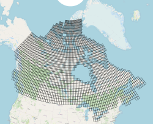

# Fetching Fathom Products from AWS S3
Simple scripts for fetching and indexing the global flood map layers from AWS S3.



# Setup

## install AWS CLI
To fetch the AWS tiles, ensure [AWS CLI](https://urldefense.com/v3/__https://docs.aws.amazon.com/cli/latest/userguide/getting-started-install.html__;!!KwNVnqRv!AUQaTXLri175i8wdJakT49wbq0zIK8Zx2hZwpQM28FFtMrc0Vsp5YES7PmwTj0bzYR5-5pZxBBO7kKb8nAObFZU$) is installed.
On Unix, this typically looks like:

```bash
sudo apt update
sudo apt install -y awscli
```

## set up AWS credentials
Fathom will probably provide you a key and an identity.
There's a few ways to pass these to AWS. Some safe, some not-so safe.
Here, we use an `~/.aws/credentials` file with a named profile.

 
Create `~/.aws/credentials` with a named profile:

```ini
[fathom]
aws_access_key_id = <your_id>
aws_secret_access_key = <your_key>
```

The fetch script sets `AWS_CONFIG_FILE` to this repo's [`aws_s3.config`](aws_s3.config) and defaults `AWS_PROFILE` to `fathom`, so it ignores the user's `~/.aws/config`.

Lock down the credentials file and test against the repo config:

```bash
chmod 600 ~/.aws/credentials
export AWS_CONFIG_FILE="$(pwd)/aws_s3.config"
export AWS_PROFILE=fathom
aws sts get-caller-identity --query Arn --output text
```

 

## definitive no-access check (WSL)
Now try a simple single fetch to test the connection and your credentials.
```bash
export AWS_CONFIG_FILE="$(pwd)/aws_s3.config"
export AWS_PROFILE=fathom

# show exactly which IAM identity is being used
aws sts get-caller-identity --query Arn --output text

# definitive proof command
aws s3api get-object \
  --bucket fathom-products-flood \
  --key flood-map-3/FLOOD_MAP-1ARCSEC-NW_OFFSET-1in10-COASTAL-DEFENDED-DEPTH-2020-PERCENTILE50-v3.1/n00e006.tif \
  ./n00e006.tif

```
Depending on what you've been granted, you may see an error like:
`An error occurred (AccessDenied) when calling the GetObject operation: User: arn:aws:iam::288631505212:user/SethBryant is not authorized to perform: s3:GetObject on resource:`

Those permission errors occur because Fathom stores all data for full global layers in the same buckets, then provides permissions to tiles that match country boundaries.
That means attempting to sync a bucket could result in many noisy permission errors.


# Run The Download
Here we use a short bash script to run `aws s3 sync` on the target buckets using the profile and credentials above.
 
```bash
# make script executable
chmod +x aws_download_cmds.sh

# set output directory for fetch
export out_dir=download

# run fetch script and log output
./aws_download_cmds.sh "$out_dir"

```

You should see something like `[1/36] syncing FLOOD_MAP-1ARCSEC-NW_OFFSET-1in50-PLUVIAL-DEFENDED-DEPTH-2020-PERCENTILE50-v3.1`.

## Check
Downloading will probably result in thousands of tiles.
Here are some helpers to summarize what you fetched.

### Table Of File Counts And Sizes
```bash
# assumes you exported $out_dir as shown above
{
  printf $'filename\tfilesize_gb\tfile_count\n'
  find "$out_dir" -mindepth 1 -maxdepth 1 -type d -print0 |
    while IFS= read -r -d '' d; do
      printf "%s\t%.3f\t%s\n" \
        "$(basename "$d")" \
        "$(du -s -B1 "$d" | awk '{print $1/1024/1024/1024}')" \
        "$(find "$d" -type f | wc -l)"
    done | sort -t$'\t' -k2,2nr
} > fetch_size.tsv
```

### Build Tile Index For Each Bucket
Here we use [gdaltindex](https://gdal.org/en/stable/programs/gdaltindex.html) to build a vector tile index of all the `.tif` tiles from each bucket.
If you don't have GDAL installed, a quick way (assuming you have conda) is:
```bash
# create a new conda environment with gdal
conda create -n gdal_basic -c conda-forge gdal libgdal
 
```


These indexes are handy if you want to locate a tile for a specific location.

```bash
# make script executable
chmod +x build_grid.sh

# check your GDAL version. this script was tested against 3.12.2 "Chicoutimi"
gdalinfo --version

# run it. assumes you exported $out_dir as shown above
./build_grid.sh --target-dir "$out_dir"

# if you get an error like `-overwrite is not supported`, you may have an older version of GDAL. either update or remove this from the script and try again.
```
